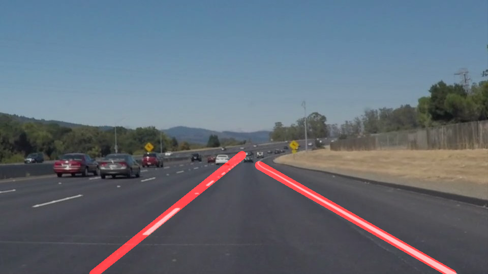
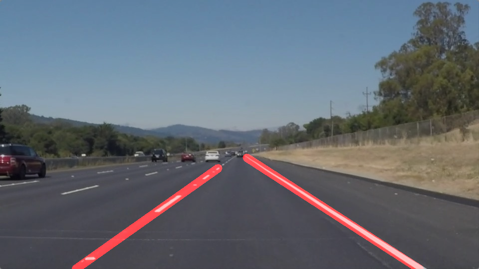
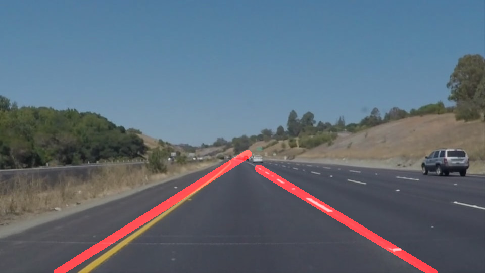
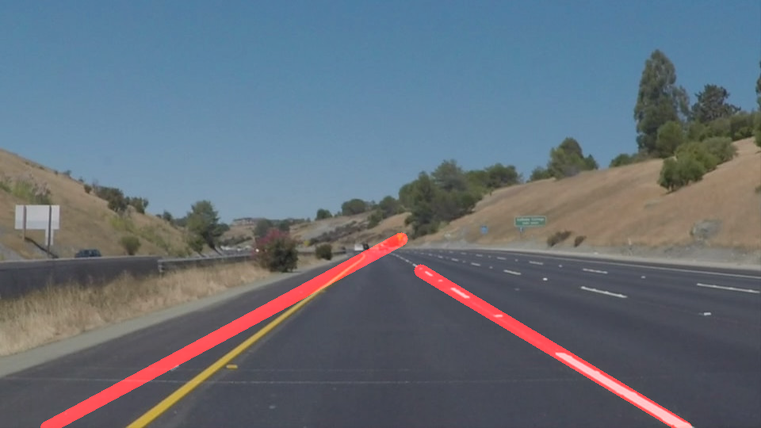
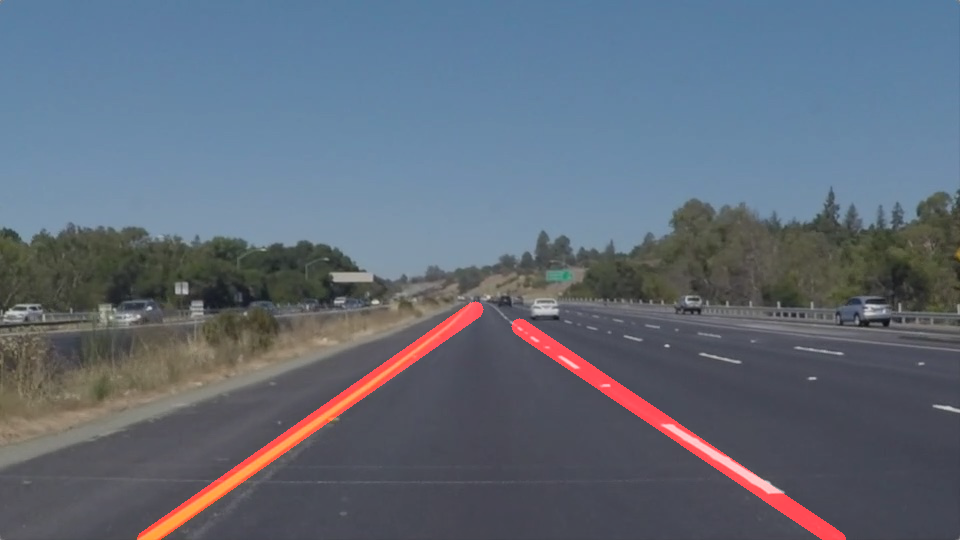
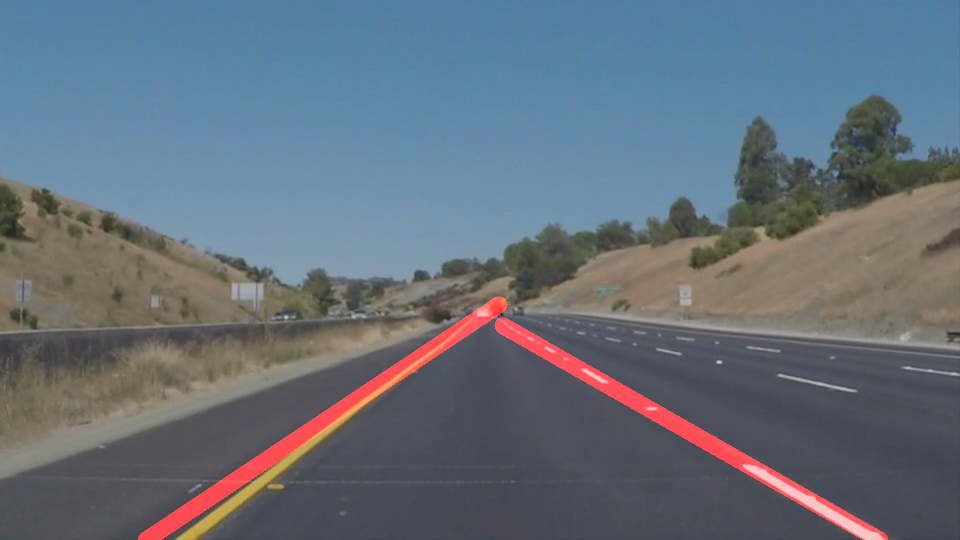

# Finding Lane Lines on the Road
***
##Pipeline
The purpose of the pipeline is to compose several different operations together, apply them to an image, and produce an annotated image that shows where a lane on a road would be.

* Canny Edge detection
* Identify regions to detect lines
* Hough transform to detect the lines
* Remove noise and draw the lanes by  extrapolating the lines identified

##Canny Edge Detection

 In canny Edge detection low thresold of 50 and high thresold of 150 is used.

##Hough Transform to detect lines

 	The hough transform is used with thresold of 15 , min_line_length of 40 and max_line_gap of 150
##Draw lines

 * To draw the line the hough lines are dvided to left or right based on their coordinates
 * Then the noise are removed based on slope falling two standard deviation from the median.
 * Then the line are extended based on the start and end line segment.

 The result of images are 

SolidWhiteCurve: 

solidWhiteRight: 

solidYellowCurve: 

solidYellowCurve2: 

solidYellowLeft: 

whiteCarLaneSwitch: 

